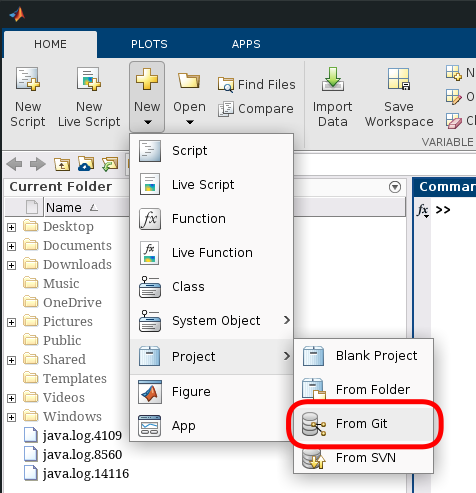
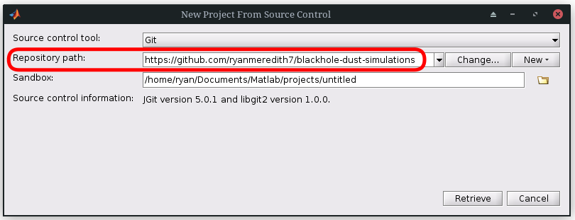
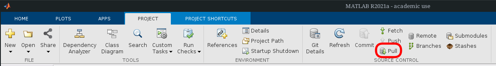
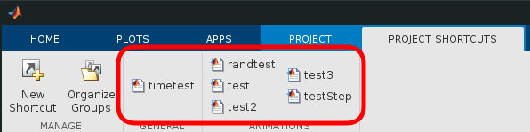

# Black Hole Dust Simulations

## Installation

This repository uses MATLAB's [projects](https://www.mathworks.com/help/matlab/projects.html)
feature, so it should be fairly easy to import and use. The simplest way to import this project into
MATLAB click on New>Project>From Git and paste the link to this repository
(`https://github.com/ryanmeredith7/blackhole-dust-simulations`) into the "Repository Path" field.

Note that the "Sandbox" field allows you to change where the project will go on your local machine.
Once you have the project in MATLAB, you can update to future changes by simply clicking the "Pull"
button under the project tab.

## Usage

The main code is found in the `lib` folder, these are the functions that will do computations. If
you set up the MATLAB project, then these function should be on MATLAB's path, but if you just
manually downloaded the code you may have to do this yourself. The `tests` folder contains example
usages of the functions in `lib` and should also be on MATLAB's path if you're using the project.
Most or all end user scripts, such as the tests, are also accessible through the "Project Shortcuts"
tab.

## Experimental C Functions

There are C functions that speed up execution by up to 300%, they require a C compiler that is
recognizable by MATLAB, you can read more about that
[here](https://www.mathworks.com/support/requirements/supported-compilers.html). To use them you
need to run the build script

    >> build

and then you need to change the scripts in which you wish to use the C functions in. For
example, if you wish to use the C function `solve` in the random test script, then you need to
change line 23 of `tests/randtest.m` from

    [a, b] = solver(ai, bi, 0, dx, dt, n);

to

    [a, b] = solve(ai, bi, 0, dx, dt, n);

At the moment, the MATLAB functions end in an "r" whereas the C functions do not, but this may be
subject to change.
